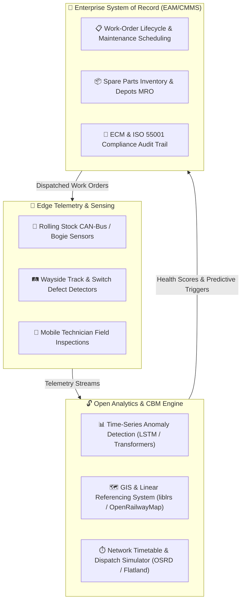

  

# 🚂 Awesome Rail Asset Management

  
  
  
  
  
  
  

---

## 🌟 Overview & Ecosystem Architecture

A curated, comprehensive index of leading **Enterprise Asset Management (EAM)** platforms, **Computerized Maintenance Management Systems (CMMS)**, **Condition-Based Maintenance (CBM)** tools, **Rolling Stock Asset Performance Management (APM)**, and **Railway Open-Source Software**.

This repository serves railway asset managers, maintenance directors, rolling-stock fleet supervisors, track infrastructure engineers, and transport digital-transformation teams architecting resilient, safe, and cost-effective railway networks.

> 📅 **Last updated: September 2026**

---

## 📑 Table of Contents

- [🌐 Market Overview & Competitive Dynamics](#-market-overview--competitive-dynamics)
- [🏢 SaaS & Commercial Enterprise Platforms](#-saas--commercial-enterprise-platforms)
- [🔓 Open-Source GitHub Repositories](#-open-source-github-repositories)
- [🛠️ Architectural Blueprints & Hybrid Stacks](#️-architectural-blueprints--hybrid-stacks)
- [🤝 How to Contribute](#-how-to-contribute)
- [📈 Star History](#-star-history)
- [⚖️ Disclaimer](#️-disclaimer)

---

## 🌐 Market Overview & Competitive Dynamics

> 📊 **Global Market Scale**: The global Railway Asset Management market is valued at approximately **$12.5B–$14.2B (2025–2026)** and is projected to expand to **$22.8B by 2032** at a compound annual growth rate (CAGR) of **~8.4%**.
>
> 🏛️ **Market Structure & Concentration**: The enterprise railway tier exhibits a **concentrated oligopolistic structure** for core safety-critical infrastructure and rolling-stock EAM—heavily dominated by industrial titans like IBM, Siemens, Hexagon, and Hitachi due to stringent safety accreditations (ISO 55001, EN 50126/50128/50129, ECM regulations). Conversely, the ecosystem is **moderately-to-highly fragmented across operational sub-sectors**, including IoT telematics, mobile track inspection apps, workshop CMMS, and AI-based predictive analytics where innovative SaaS and agile CBM point solutions thrive alongside enterprise systems of record.

---

## 🏢 SaaS & Commercial Enterprise Platforms

The table below catalogs premier commercial SaaS and hosted platforms serving railway operators, infrastructure managers, and rolling stock maintainers.

*Sorted in descending order by **Company Scale (Valuation / Revenue)**.*

| 🚆 SaaS Platform | 🏢 Company Scale (Valuation / Revenue) | 🎯 Focus & Rail Capabilities | 💳 Starting Pricing | 🎁 Free Tier / Free Trial Limits |
| :--- | :--- | :--- | :--- | :--- |
| **[IBM Maximo Application Suite](https://www.ibm.com/products/maximo)** | **IBM** (NYSE: IBM) • Market Cap: **~$215B** • Revenue: **~$62B/yr** | Enterprise asset management (EAM), asset performance management (APM), linear asset modeling, IoT sensor integration, and regulatory compliance for rolling stock and rail infrastructure. | **$210/user/month** (or AppPoints Essentials tier starting at ~$40,000/year base subscription) | **14-day free trial**; includes full hands-on access to Maximo Manage and Maximo Health in a sandbox environment with pre-populated railway asset data (no credit card required). |
| **[Brightly Assetic](https://www.brightlysoftware.com/en-gb/software/assetic)** | **Siemens AG** (ETR: SIE) • Market Cap: **~$160B** • Revenue: **~$85B/yr** *(Brightly acquired for $1.58B)* | Strategic asset management (SAMP), lifecycle degradation modeling, capital expenditure (CapEx) optimization, and network condition scoring for rail corridors. | **$8,500/year** starting base tier (or ~$120/user/month for core maintenance planning and asset registers) | **14-day guided proof-of-concept trial**; capped at 3 user profiles and a sample import of up to 500 asset registry records. |
| **[Hitachi Rail (HMAX)](https://www.hitachirail.com/products-and-solutions/digital/)** | **Hitachi, Ltd.** (TYO: 6501) • Market Cap: **~$105B** • Group Revenue: **~$67B/yr** *(Rail: ~$7.5B)* | AI-driven rolling stock diagnostics, real-time train telemetry ingestion, predictive bogie/wheelset maintenance, and signaling infrastructure analytics. | **~$50,000/year** base platform subscription (or ~$250/vehicle/month base telemetry and condition monitoring package) | **60-day proof-of-value pilot program**; restricted to telemetry data ingestion for up to 2 trainsets or 5 km of monitored wayside track infrastructure. |
| **[Trapeze EAM](https://www.trapezegroup.com/solutions/enterprise-asset-management/)** | **Constellation Software / Modaxo** (TSX: CSU) • Market Cap: **~$68B** • Revenue: **~$9.3B/yr** | Transit and passenger rail EAM covering state of good repair (SGR), rolling stock fleet maintenance, warranty tracking, and regulatory/FTA compliance. | **£12,000/year (~$15,000/year)** base subscription for small fleets (or ~$150/user/month for core operations) | **30-day interactive sandbox trial** upon sales qualification; restricted to 5 test user accounts and up to 50 vehicle asset records. |
| **[Fiix CMMS](https://www.fiixsoftware.com/)** | **Rockwell Automation** (NYSE: ROK) • Market Cap: **~$32B** • Revenue: **~$9.1B/yr** | Cloud CMMS/EAM for rail workshop scheduling, rolling stock preventative maintenance, work order automation, and spare parts inventory management. | **$45/user/month** (Basic tier, billed annually) | **Free Forever Plan**: up to 3 users, 25 active preventive maintenance (PM) tasks, basic work order tracking, and mobile app access. |
| **[HxGN EAM (Hexagon)](https://hexagon.com/products/product-groups/enterprise-asset-management)** | **Hexagon AB** (STO: HEXA-B) • Market Cap: **~$30B** • Revenue: **~$5.6B/yr** | Deep linear asset hierarchies, condition-based track/fleet maintenance, asset investment planning, and depot work-order scheduling. | **$75/user/month** (or £77/user/year for requestors up to £1,200/named user/year; entry package base starts at ~$7,000/month) | **30-day proof-of-concept trial** upon sales qualification; capped at 5 administrative user accounts and 100 sample asset records in a staging environment. |
| **[Trimble Rail Asset Management](https://rail.trimble.com/)** | **Trimble Inc.** (NASDAQ: TRMB) • Market Cap: **~$17B** • Revenue: **~$3.8B/yr** | Remote condition monitoring (R2M), component condition monitoring (C2M), rolling stock defect detection, and automated wayside inspection planning. | **~$25,000/year** starting fleet diagnostic package (or ~$180/connected vehicle/month) | **30-day simulated telemetry testbed demo**; limited to 10 rail vehicle profiles with pre-configured sensor alerts and diagnostic rules. |
| **[Bentley AssetWise](https://www.bentley.com/software/assetwise/)** | **Bentley Systems** (NASDAQ: BSY) • Market Cap: **~$16B** • Revenue: **~$1.3B/yr** | Infrastructure lifecycle management, linear track segmentation, corridor geolocated asset registers, bridge/tunnel structural health, and railway capital investment planning. | **£356/user/year (~$465/user/year or ~$39/user/month)** via G-Cloud (minimum 50-user entry instance, £17,800/year base) | **30-day Bentley Infrastructure Cloud test-drive**; includes 500 MB cloud storage and collaboration access for up to 3 team members. |
| **[IFS Cloud](https://www.ifs.com/solutions/enterprise-asset-management)** | **IFS / EQT & TA Associates** • Valuation: **~$15B+** • Revenue: **~$1.4B ARR** | Unified EAM, field service management (FSM), and MRO supply chain for transit authorities, rolling stock operators, and rail maintenance depots. | **$110/user/month** (entry tier based on a 100-user minimum baseline, ~$132,000/year base subscription) | **30-day sandbox enablement trial** for qualified enterprise rail operators; capped at 10 user licenses in a dedicated non-production cloud instance. |
| **[MaintainX](https://www.getmaintainx.com/)** | **MaintainX** • Valuation: **~$1.0B** • Series C Unicorn (~$50M+ ARR) | Digital work orders, mobile inspection forms, depot maintenance scheduling, regulatory audit trails, and technician chat for rail workshops. | **$19/user/month** (Essential tier, billed annually; or $21/month billed monthly) | **Free Forever Plan**: unlimited work orders, unlimited requesters, up to 2 active repeating PM tasks, basic asset register, and 1-month analytics history. 30-day free trial for Enterprise features. |
| **[UpKeep CMMS](https://www.upkeep.com/)** | **UpKeep Technologies** • Valuation: **~$400M** • Series C (~$50M ARR) | Mobile-first maintenance management, work order generation, depot parts inventory, track inspection checklists, and free requester accounts for rail staff. | **$24/user/month** (Essential tier, billed annually; unlimited requester and view-only accounts included) | **7-day free trial** with full access to Business Plus features, unlimited work orders, and asset tracking (no credit card required); unlimited free requester seats indefinitely. |
| **[RailSmart (3Squared)](https://3squared.com/products/railsmart/)** | **3Squared / EPM Transport Solutions** • Valuation: **~£20M (~$26M)** | Suite of specialized rail operations and asset safety tools (RailSmart EDS, defect reporting, competency management, and trackside asset inspection). | **£9,500/year (~$12,400/year)** base license for Small tier (or £20 to £295/user/year under UK G-Cloud framework) | **14-day pilot sandbox access**; includes up to 5 mobile inspector licenses, defect logging module, and standard digital reporting templates. |
| **[RailCube](https://www.railcube.com/)** | **RailCube B.V.** • Scale: **~€15M (~$16M) Rev** | Railway ERP and operations platform for rail freight and passenger operators, ECM-compliant maintenance tracking, and locomotive availability planning. | **€450/month (~$490/month)** starting tier for regional operators (includes up to 5 users and core maintenance/operations modules) | **14-day guided sandbox demo trial**; pre-configured with rolling stock templates, certificate tracking, and scheduled maintenance workflows. |
| **[Railnova (Railfleet & Railster)](https://www.railnova.eu/)** | **Railnova SA** • Scale: **~€10M (~$11M) Rev** | Rail IoT telematics hardware (Railster) with cloud maintenance workflow software (Railfleet), ECM compliance, and locomotive GPS/CAN-bus diagnostics. | **€89/locomotive/month (~$98/month)** for Railfleet SaaS subscription (telematics hardware unit billed separately) | **30-day evaluation trial**; includes full Railfleet web access and 1 evaluation Railster telematics hardware unit for 1 locomotive. |

---

## 🔓 Open-Source GitHub Repositories

Open-source rail engineering encompasses CBM decision-support algorithms, linear referencing libraries, train dispatching simulations, and self-hosted CMMS backends.

*Sorted in descending order by **GitHub_Stars**.*

1. **[`IBM/AssetOpsBench`](https://github.com/IBM/AssetOpsBench)**   
   *Industry 4.0 benchmark and framework for building, orchestrating, and evaluating AI-driven predictive maintenance, asset degradation modeling, and operational decision-support agents.*

2. **[`Grashjs/cmms`](https://github.com/Grashjs/cmms)**   
   *Self-hosted open-source CMMS web and mobile platform for managing industrial enterprise maintenance, automated preventative maintenance scheduling, and depot spare-parts inventory.*

3. **[`umbertogriffo/Predictive-Maintenance-using-LSTM`](https://github.com/umbertogriffo/Predictive-Maintenance-using-LSTM)**   
   *Multivariate time-series condition monitoring and remaining useful life (RUL) estimation using LSTM neural networks, directly adaptable to locomotive telemetry and wheelset wear sensors.*

4. **[`OpenRailAssociation/osrd`](https://github.com/OpenRailAssociation/osrd)**   
   *Open Source Railway Designer (OSRD) — full-stack open-source web application for railway infrastructure design, electrical/signaling capacity simulation, operational conflict detection, and timetable planning.*

5. **[`OpenRailwayMap/openrailwaymap`](https://github.com/OpenRailwayMap/openrailwaymap)**   
   *The global open railway infrastructure mapping project based on OpenStreetMap data, providing vector tile schemas for track alignments, switch points, signaling, catenary, and speed limits.*

6. **[`jiaxiang-cheng/PyTorch-Transformer-for-RUL-Prediction`](https://github.com/jiaxiang-cheng/PyTorch-Transformer-for-RUL-Prediction)**   
   *Transformer-based deep learning architecture implemented in PyTorch for high-accuracy remaining useful life (RUL) prediction and degradation trajectory forecasting from continuous sensor streams.*

7. **[`Charlie5DH/PredictiveMaintenance-and-Vibration-Resources`](https://github.com/Charlie5DH/PredictiveMaintenance-and-Vibration-Resources)**   
   *Comprehensive repository of algorithms, signal processing methods, vibration datasets, and spectral analysis tools for bearing fault detection and bogie condition-based maintenance.*

8. **[`kokikwbt/predictive-maintenance`](https://github.com/kokikwbt/predictive-maintenance)**   
   *Curated industrial condition monitoring datasets, signal processing pipelines, and predictive maintenance machine learning models for early mechanical anomaly detection.*

9. **[`flatland-association/flatland-rl`](https://github.com/flatland-association/flatland-rl)**   
   *Multi-agent reinforcement learning simulation framework for resilient railway operations, train dispatching, real-time rescheduling, and traffic management under network disruptions.*

10. **[`liberusoftware/maintenance-laravel`](https://github.com/liberusoftware/maintenance-laravel)**   
    *Web-based CMMS platform for equipment registers, maintenance checklists, recurring work orders, and parts inventory tracking.*

11. **[`durgeshsahu16/Railway-Track-fault-Detection-Project`](https://github.com/durgeshsahu16/Railway-Track-fault-Detection-Project)**   
    *Computer vision classification system using TensorFlow and convolutional neural networks for automated track surface crack, joint, and fastener defect detection.*

12. **[`OpenRailAssociation/liblrs`](https://github.com/OpenRailAssociation/liblrs)**   
    *High-performance Linear Referencing System (LRS) library for geographical rail track segmentation, kilometer-post referencing, and linear infrastructure asset spatial mapping.*

13. **[`modernecotech/OpenSourceRail`](https://github.com/modernecotech/OpenSourceRail)**   
    *Open-source stack for urban light metro and rail design, vehicle simulation, operational testing, QA maintenance routines, and regulatory compliance evidence tracking.*

14. **[`zhootoo/railway_fault_detect`](https://github.com/zhootoo/railway_fault_detect)**   
    *Machine learning diagnostic toolkit designed for railway turnout and switch-point mechanical fault detection using actuator current signatures.*

---

## 🛠️ Architectural Blueprints & Hybrid Stacks

Most mature railway operations implement a **hybrid architecture** that blends enterprise resilience with open-source analytical agility:

---

## 🤝 How to Contribute

We welcome contributions from rail asset managers, data scientists, and railway software engineers!

1. 🍴 **Fork** this repository.
2. 🌿 **Create a Branch** (`git checkout -b feature/rail-tool`).
3. 📝 **Add Your Entry**:
   - Provide the platform or repo name, official link, and factual description.
   - For SaaS: include specific starting pricing, company scale/valuation, and exact free tier/trial limits.
   - For open-source: include repository link with stargazer badge (`style=social&color=white`).
4. 🚀 **Submit a Pull Request** with a concise summary of the addition.

---

## 📈 Star History

---

## ⚖️ Disclaimer

- This repository is a **community-curated index** and does not constitute formal procurement endorsement.
- Railway operations govern safety-critical infrastructure. Always verify compliance with local railway authorities (e.g., FRA, ERA, RSSB, UIC) and certified engineering standards (EN 50126/8/9, ISO 55001).
- Open-source libraries provide algorithmic building blocks and require rigorous integration, cybersecurity auditing, and domain validation before deployment in live operational environments.

---

  Made with ❤️ for railway asset managers, fleet directors, permanent-way engineers, and transit operators worldwide.

